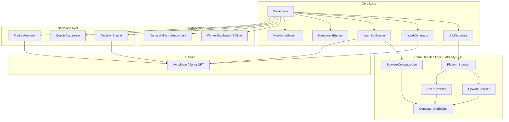
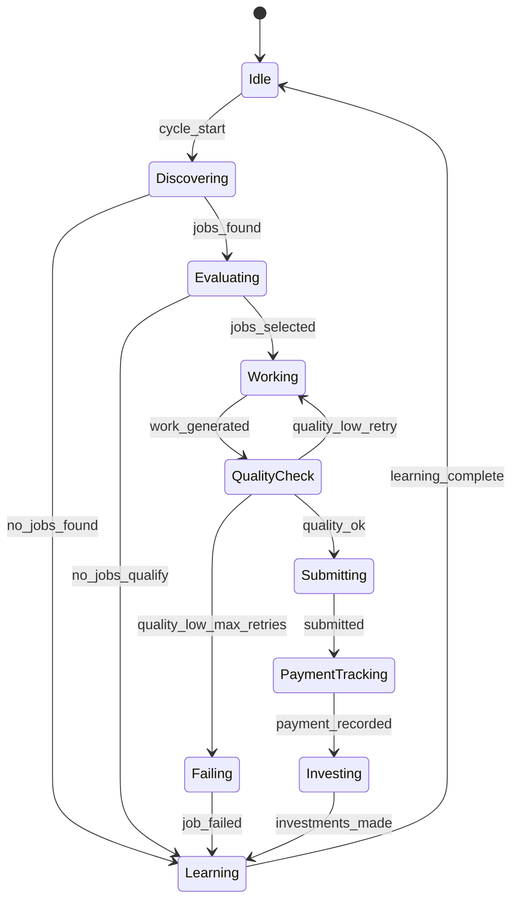

# Design Document: Janus Autonomous Worker Completion

## Overview

Janus is a fully autonomous AI worker that operates like a human professional on a physical EliteDesk machine. The defining architectural principle is **computer-use-first**: Janus interacts with job platforms, learning resources, and payment systems by opening Chrome and using them exactly as a human would — clicking buttons, reading screens, filling forms, and navigating pages. No API keys, no OAuth flows, no rate-limit headaches.

This design completes the `janus_autonomous_worker.py` framework by wiring together the already-built subsystems (`janus_computer_use.py`, `janus_wallet.py`, `janus_platform_browser.py`) into a coherent, self-improving work loop.

### Design Philosophy

| Concern | Approach |
|---|---|
| Job discovery | `PlatformBrowser` opens Chrome → navigates Upwork/Fiverr → reads listings via OCR |
| Job application | `UpworkBrowser.apply_to_job()` / `FiverrBrowser.search_buyer_requests()` |
| Work delivery | `UpworkBrowser.submit_work()` / `FiverrBrowser.deliver_order()` |
| Learning | `BrowserComputerUse` opens YouTube/Google → reads/watches → Avus extracts concepts |
| Payment tracking | `JanusWallet` records income locally; PayPal browser check as optional verification |
| AI work generation | `AvusBrain` (or `JanusGPT`) generates deliverables from job context |
| Persistence | SQLite via existing `WalletLedger` pattern, extended for jobs/skills |
| Monitoring | Structured logging to `janus_worker.log` |

### Key Design Decisions

- **No new API integrations**: All platform interaction goes through `janus_computer_use.py` + `janus_platform_browser.py`. The existing `UpworkIntegration` / `FiverrIntegration` API-key paths remain as dead-letter fallbacks only.
- **Avus is the brain**: All work generation, concept extraction, job scoring, and market analysis are delegated to `AvusBrain.ask()` with structured prompts.
- **Wallet is the ledger**: `JanusWallet` (already built) is the single source of truth for all financial state. No parallel financial tracking.
- **Async throughout**: All I/O-bound operations use `asyncio`. CPU-bound work (scoring, analytics) runs synchronously.
- **Graceful degradation**: Every subsystem has a fallback. If the browser fails, Janus logs the error, skips the job, and continues.

---

## Architecture



### Work Cycle State Machine



---

## Components and Interfaces

### WorkCycle (orchestrator)

The top-level coordinator. Runs the main `asyncio` event loop and sequences all subsystems.

```python
class WorkCycle:
    def __init__(
        self,
        db: WorkerDatabase,
        wallet: JanusWallet,
        decision_engine: DecisionEngine,
        work_generator: WorkGenerator,
        learning_engine: LearningEngine,
        quality_assurance: QualityAssurance,
        investment_engine: InvestmentEngine,
        market_analyzer: MarketAnalyzer,
        monitor: MonitoringSystem,
        max_concurrent_jobs: int = 5,
    ): ...

    async def run_forever(self) -> None: ...
    async def run_one_cycle(self) -> CycleSummary: ...
    async def _discover_jobs(self) -> List[BrowserJob]: ...
    async def _execute_job(self, job: BrowserJob) -> JobResult: ...
    async def _run_learning_session(self) -> None: ...
    async def _run_investment_check(self) -> None: ...
```

### JobDiscovery

Wraps `PlatformBrowser` to find jobs matching Janus's current skills.

```python
class JobDiscovery:
    def __init__(self, engine: ComputerUseEngine, skills: List[str]): ...
    async def find_jobs(self, platforms: List[str] = ["upwork", "fiverr"]) -> List[BrowserJob]: ...
    async def apply_to_job(self, job: BrowserJob, proposal: str) -> bool: ...
```

### WorkGenerator

Calls `AvusBrain` to produce deliverables. Formats output by job type.

```python
class WorkGenerator:
    def __init__(self, brain: Any): ...  # AvusBrain or JanusGPT

    async def generate(self, job: BrowserJob) -> WorkResult: ...
    def _build_prompt(self, job: BrowserJob) -> str: ...
    def _format_output(self, raw: str, job_type: str) -> str: ...
    def _validate_quality(self, work: str, job: BrowserJob) -> float: ...  # returns 0.0–1.0

@dataclass
class WorkResult:
    content: str
    job_type: str
    quality_score: float
    generation_time_seconds: float
    attempts: int
    metadata: Dict[str, Any]
```

### LearningEngine

Opens a browser, searches YouTube or Google, reads content, and uses Avus to extract concepts.

```python
class LearningEngine:
    def __init__(self, engine: ComputerUseEngine, brain: Any, db: WorkerDatabase): ...

    async def learn_skill(self, skill_name: str) -> LearningResult: ...
    async def _search_youtube(self, query: str) -> List[Dict]: ...
    async def _search_web(self, query: str) -> List[Dict]: ...
    async def _extract_concepts(self, content: str, skill: str) -> List[str]: ...
    async def _map_concepts_to_skills(self, concepts: List[str]) -> Dict[str, float]: ...

@dataclass
class LearningResult:
    skill_name: str
    concepts_learned: List[str]
    skill_delta: float          # improvement in proficiency (0.0–1.0)
    resources_used: List[str]   # URLs visited
    duration_seconds: float
```

### DecisionEngine

Scores and selects jobs. Pure functions — no I/O.

```python
class DecisionEngine:
    WEIGHTS = {"skill_match": 0.40, "budget": 0.30, "deadline": 0.20, "learning": 0.10}

    def score_job(self, job: BrowserJob, skills: Dict[str, SkillLevel]) -> float: ...
    def select_jobs(self, jobs: List[BrowserJob], skills: Dict[str, SkillLevel], max_jobs: int) -> List[BrowserJob]: ...
    def _skill_match_score(self, required: List[str], available: Dict[str, SkillLevel]) -> float: ...
    def _budget_score(self, budget: float, market_avg: float) -> float: ...
    def _deadline_score(self, deadline: datetime) -> float: ...
    def _learning_score(self, required: List[str], available: Dict[str, SkillLevel]) -> float: ...
```

### QualityAssurance

Validates generated work before submission.

```python
class QualityAssurance:
    MIN_QUALITY_THRESHOLD = 0.7
    MAX_RETRIES = 3

    def validate(self, work: WorkResult, job: BrowserJob) -> QAResult: ...
    def _check_completeness(self, work: str, job: BrowserJob) -> float: ...
    def _check_relevance(self, work: str, job: BrowserJob) -> float: ...
    def _check_format(self, work: str, job_type: str) -> float: ...

@dataclass
class QAResult:
    passed: bool
    score: float                # 0.0–1.0
    completeness: float
    relevance: float
    format_score: float
    feedback: str
```

### InvestmentEngine

Decides how to spend earned money. Delegates to `JanusWallet` for all financial operations.

```python
class InvestmentEngine:
    COMPUTE_THRESHOLD = 100.0   # USD
    COURSE_THRESHOLD = 50.0     # USD

    def __init__(self, wallet: JanusWallet, brain: Any): ...
    async def evaluate_and_invest(self) -> List[InvestmentAction]: ...
    def _should_invest(self, balance: Decimal) -> bool: ...
    def _prioritize_investments(self, balance: Decimal, weak_skills: List[str]) -> List[InvestmentAction]: ...

@dataclass
class InvestmentAction:
    category: str               # "compute", "training", "course"
    amount: Decimal
    description: str
    expected_roi: float
    executed: bool = False
```

### MarketAnalyzer

Analyzes job history to identify trends. Pure functions over DB data.

```python
class MarketAnalyzer:
    def __init__(self, db: WorkerDatabase, brain: Any): ...

    def analyze(self, job_history: List[JobRecord]) -> MarketAnalysis: ...
    def trending_skills(self, history: List[JobRecord]) -> List[str]: ...
    def high_paying_types(self, history: List[JobRecord]) -> List[str]: ...
    def skill_roi(self, history: List[JobRecord]) -> Dict[str, float]: ...

@dataclass
class MarketAnalysis:
    trending_skills: List[str]
    high_paying_job_types: List[str]
    emerging_opportunities: List[str]
    skill_roi: Dict[str, float]
    confidence: float
    data_sources: List[str]
    recommendations: List[str]
```

### MonitoringSystem

Structured logging and metrics aggregation.

```python
class MonitoringSystem:
    def __init__(self, log_path: str = "janus_worker.log"): ...

    def log_event(self, event_type: str, context: Dict[str, Any]) -> None: ...
    def log_job_claimed(self, job: BrowserJob, rationale: str) -> None: ...
    def log_work_generated(self, job_id: str, quality: float, time_s: float) -> None: ...
    def log_job_completed(self, job_id: str, quality: float) -> None: ...
    def log_payment(self, amount: Decimal, platform: str) -> None: ...
    def log_skill_improved(self, skill: str, new_level: str, resources: List[str]) -> None: ...
    def log_error(self, error_type: str, tb: str, recovery: str) -> None: ...
    def get_metrics(self) -> PerformanceMetrics: ...

@dataclass
class PerformanceMetrics:
    jobs_completed: int
    total_earned: Decimal
    average_job_value: Decimal
    skill_levels: Dict[str, str]
    error_rate: float
    success_rate: float
```

---

## Data Models

### WorkerDatabase

Extends the `WalletLedger` pattern with additional tables for jobs, skills, and learning.

```python
class WorkerDatabase:
    """SQLite persistence for all worker state beyond financial data."""

    SCHEMA = """
    CREATE TABLE IF NOT EXISTS jobs (
        id              TEXT PRIMARY KEY,
        title           TEXT NOT NULL,
        description     TEXT NOT NULL DEFAULT '',
        platform        TEXT NOT NULL,
        budget          REAL NOT NULL DEFAULT 0,
        status          TEXT NOT NULL DEFAULT 'available',
        claimed_at      TEXT,
        completed_at    TEXT,
        quality_score   REAL,
        payment_amount  REAL,
        metadata        TEXT NOT NULL DEFAULT '{}'
    );

    CREATE TABLE IF NOT EXISTS skills (
        name            TEXT PRIMARY KEY,
        level           TEXT NOT NULL DEFAULT 'BEGINNER',
        experience_pts  INTEGER NOT NULL DEFAULT 0,
        success_rate    REAL NOT NULL DEFAULT 0.5,
        last_used       TEXT,
        last_improved   TEXT
    );

    CREATE TABLE IF NOT EXISTS learning_resources (
        id              TEXT PRIMARY KEY,
        url             TEXT NOT NULL,
        title           TEXT NOT NULL DEFAULT '',
        topic           TEXT NOT NULL,
        resource_type   TEXT NOT NULL DEFAULT 'web',
        concepts        TEXT NOT NULL DEFAULT '[]',
        completed_at    TEXT,
        skill_delta     REAL NOT NULL DEFAULT 0
    );

    CREATE TABLE IF NOT EXISTS cycle_summaries (
        id              TEXT PRIMARY KEY,
        started_at      TEXT NOT NULL,
        completed_at    TEXT NOT NULL,
        jobs_processed  INTEGER NOT NULL DEFAULT 0,
        earnings        REAL NOT NULL DEFAULT 0,
        skills_improved TEXT NOT NULL DEFAULT '[]',
        errors          INTEGER NOT NULL DEFAULT 0
    );
    """
```

### JobRecord (read model from DB)

```python
@dataclass
class JobRecord:
    id: str
    title: str
    description: str
    platform: str
    budget: float
    status: str
    claimed_at: Optional[datetime]
    completed_at: Optional[datetime]
    quality_score: Optional[float]
    payment_amount: Optional[float]
    metadata: Dict[str, Any]
```

### CycleSummary

```python
@dataclass
class CycleSummary:
    cycle_id: str
    started_at: datetime
    completed_at: datetime
    jobs_processed: int
    earnings: Decimal
    skills_improved: List[str]
    errors: int
    state: str   # "completed" | "partial" | "failed"
```

---

## Correctness Properties

*A property is a characteristic or behavior that should hold true across all valid executions of a system — essentially, a formal statement about what the system should do. Properties serve as the bridge between human-readable specifications and machine-verifiable correctness guarantees.*

### Property 1: Work prompt contains all job context fields

*For any* `BrowserJob` with non-empty `title`, `description`, and `required_skills`, the prompt built by `WorkGenerator._build_prompt()` SHALL contain the job title, description, and each required skill as substrings.

**Validates: Requirements 1.2**

---

### Property 2: Quality validator score is always in [0.0, 1.0]

*For any* work string and job object passed to `QualityAssurance.validate()`, the returned `QAResult.score` SHALL be a float in the closed interval [0.0, 1.0], and each sub-score (`completeness`, `relevance`, `format_score`) SHALL also be in [0.0, 1.0].

**Validates: Requirements 1.3, 14.1**

---

### Property 3: Low-quality work is never submitted

*For any* `WorkResult` where `quality_score < 0.7`, the `WorkCycle` SHALL NOT call `PlatformBrowser.deliver()` or `UpworkBrowser.submit_work()` for that result.

**Validates: Requirements 1.4, 14.3**

---

### Property 4: Work metrics always contain required fields

*For any* completed call to `WorkGenerator.generate()`, the returned `WorkResult` SHALL have non-None values for `quality_score`, `generation_time_seconds`, and `attempts`, with `quality_score` in [0.0, 1.0] and `generation_time_seconds` ≥ 0.

**Validates: Requirements 1.5, 8.3**

---

### Property 5: Concept extraction returns valid skill mappings

*For any* non-empty transcript or article text passed to `LearningEngine._extract_concepts()`, the returned concept list SHALL be non-empty, and every skill name returned by `_map_concepts_to_skills()` SHALL exist in the known skills registry.

**Validates: Requirements 2.4, 2.5**

---

### Property 6: Exponential backoff delays follow the correct sequence

*For any* retry attempt number N in {1, 2, 3, 4, 5}, the computed backoff delay SHALL equal 2^(N-1) seconds (i.e., 1, 2, 4, 8, 16 seconds respectively).

**Validates: Requirements 5.1**

---

### Property 7: Job score is always in [0.0, 1.0]

*For any* `BrowserJob` and skill dictionary passed to `DecisionEngine.score_job()`, the returned score SHALL be a float in the closed interval [0.0, 1.0].

**Validates: Requirements 6.1**

---

### Property 8: Weighted job score equals the formula

*For any* four component scores `s_match`, `s_budget`, `s_deadline`, `s_learning` each in [0.0, 1.0], the total score computed by `DecisionEngine.score_job()` SHALL equal `0.40 * s_match + 0.30 * s_budget + 0.20 * s_deadline + 0.10 * s_learning` within floating-point tolerance (1e-9).

**Validates: Requirements 6.2**

---

### Property 9: Selected jobs are always the top-N by score

*For any* list of scored jobs and a capacity limit N, the jobs returned by `DecisionEngine.select_jobs()` SHALL be exactly the N jobs with the highest scores (or all jobs if fewer than N qualify), and no selected job SHALL have a score below 0.5.

**Validates: Requirements 6.3, 6.4**

---

### Property 10: Active job count never exceeds configured maximum

*For any* sequence of job claim and completion events processed by `WorkCycle`, the number of concurrently active jobs SHALL never exceed `max_concurrent_jobs` at any point in the sequence.

**Validates: Requirements 17.1**

---

### Property 11: Job priority queue is ordered by deadline ascending

*For any* set of active jobs with distinct deadlines, the priority order produced by `WorkCycle` SHALL place the job with the earliest deadline first (i.e., jobs are sorted by `deadline` ascending).

**Validates: Requirements 17.4**

---

### Property 12: Financial aggregation is arithmetically correct

*For any* list of `Transaction` objects, the values computed by `JanusWallet` SHALL satisfy: `total_earned = sum(tx.amount for tx if tx.tx_type == INCOME)`, `total_spent = sum(tx.amount for tx if tx.tx_type == EXPENSE)`, and `current_balance = total_earned - total_spent`.

**Validates: Requirements 15.3**

---

### Property 13: Job persistence round-trip preserves all fields

*For any* `JobRecord` written to `WorkerDatabase`, reading it back by `id` SHALL return a record where `id`, `title`, `description`, `platform`, `budget`, and `status` are identical to the original.

**Validates: Requirements 9.3**

---

### Property 14: Skill persistence round-trip preserves all fields

*For any* `Skill` object written to `WorkerDatabase`, reading it back by `name` SHALL return a record where `name`, `level`, `experience_pts`, and `success_rate` are identical to the original.

**Validates: Requirements 9.4**

---

### Property 15: Performance metrics contain all required fields

*For any* job and payment history passed to `MonitoringSystem.get_metrics()`, the returned `PerformanceMetrics` SHALL have non-None values for `jobs_completed`, `total_earned`, `average_job_value`, `skill_levels`, and `error_rate`.

**Validates: Requirements 8.8**

---

### Property 16: Market analysis always returns required keys

*For any* job history list (including empty) passed to `MarketAnalyzer.analyze()`, the returned `MarketAnalysis` SHALL have non-None values for `trending_skills`, `high_paying_job_types`, `emerging_opportunities`, `skill_roi`, and `recommendations`.

**Validates: Requirements 19.1**

---

## Error Handling

### Browser Interaction Failures

`PlatformBrowser`, `UpworkBrowser`, and `FiverrBrowser` all return `bool` or empty lists on failure — they never raise. `WorkCycle` checks return values and falls back:

1. If `UpworkBrowser` fails → try `FiverrBrowser`
2. If both fail → skip discovery, run learning session instead
3. Log all failures with `MonitoringSystem.log_error()`

### Work Generation Failures

`WorkGenerator.generate()` retries up to `MAX_RETRIES = 3` times with adjusted prompts. If all retries fail, it returns a `WorkResult` with `quality_score = 0.0`. `WorkCycle` marks the job as failed and moves on.

### Database Failures

All `WorkerDatabase` writes are wrapped in SQLite transactions. On `sqlite3.Error`, the transaction is rolled back and the operation is retried once. If the retry fails, the error is logged and the in-memory state is preserved for the current cycle.

### Exponential Backoff

Used for any retriable operation (browser navigation retries, Avus API calls):

```python
async def _with_backoff(coro, max_retries=5):
    delays = [1, 2, 4, 8, 16]
    for attempt, delay in enumerate(delays[:max_retries]):
        try:
            return await coro()
        except Exception as e:
            if attempt == max_retries - 1:
                raise
            await asyncio.sleep(delay)
```

### Critical Error Handling

If `ComputerUseEngine` raises an unhandled exception during a job, `WorkCycle` catches it, logs the full traceback, marks the job as failed, and continues to the next cycle. The system never crashes on a single job failure.

### Credential Security

- All credentials loaded from environment variables (`.env` file, never committed)
- Credentials never appear in log output (filtered by `MonitoringSystem`)
- Browser sessions use the existing Chrome profile — no credential storage in code

---

## Testing Strategy

### Dual Testing Approach

Unit tests cover specific examples, edge cases, and error conditions. Property-based tests verify universal invariants across randomised inputs using **Hypothesis** (pytest-hypothesis).

Each property test runs a minimum of **100 iterations** (`@settings(max_examples=100)`) and is tagged:

```python
# Feature: janus-autonomous-worker-completion, Property N: <property_text>
```

### Property-Based Tests (Hypothesis)

| Test File | Properties Covered |
|---|---|
| `test_work_generator.py` | 1, 2, 3, 4 |
| `test_learning_engine.py` | 5 |
| `test_error_recovery.py` | 6 |
| `test_decision_engine.py` | 7, 8, 9 |
| `test_work_cycle.py` | 10, 11 |
| `test_financial.py` | 12 |
| `test_worker_database.py` | 13, 14 |
| `test_monitoring.py` | 15 |
| `test_market_analyzer.py` | 16 |

### Unit Tests

Focused on:
- `WorkGenerator` prompt construction for each job type (code, document, design)
- `QualityAssurance` threshold enforcement (score < 0.7 → reject)
- `DecisionEngine` job selection with ties and edge cases
- `LearningEngine` fallback from YouTube to web search
- `InvestmentEngine` threshold checks ($100 compute, $50 course)
- `WorkCycle` state transitions (discovering → evaluating → working → submitting)
- `MonitoringSystem` log format and field presence
- `WorkerDatabase` schema creation and migration

All browser interactions (`PlatformBrowser`, `BrowserComputerUse`, `ComputerUseEngine`) are mocked using `unittest.mock.AsyncMock` so tests run without a display or network.

### Integration Tests

- Full cycle smoke test: mock browser returns 1 job, Avus returns valid work, verify DB has job record and wallet has income transaction
- Browser fallback: mock Upwork browser failure, verify Fiverr browser is tried
- Database persistence: write and read back all record types
- Wallet integration: verify `JanusWallet.record_income()` is called after successful job delivery

### Test File Structure

```
tests/
  test_work_generator.py       # Properties 1–4 + unit tests
  test_learning_engine.py      # Property 5 + unit tests
  test_error_recovery.py       # Property 6 + unit tests
  test_decision_engine.py      # Properties 7–9 + unit tests
  test_work_cycle.py           # Properties 10–11 + unit tests
  test_financial.py            # Property 12 + unit tests
  test_worker_database.py      # Properties 13–14 + unit tests
  test_monitoring.py           # Property 15 + unit tests
  test_market_analyzer.py      # Property 16 + unit tests
  test_integration.py          # End-to-end smoke tests
```
