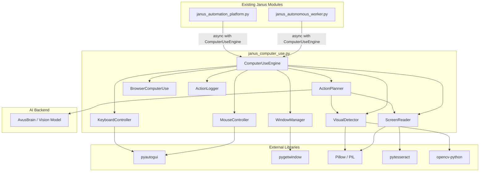
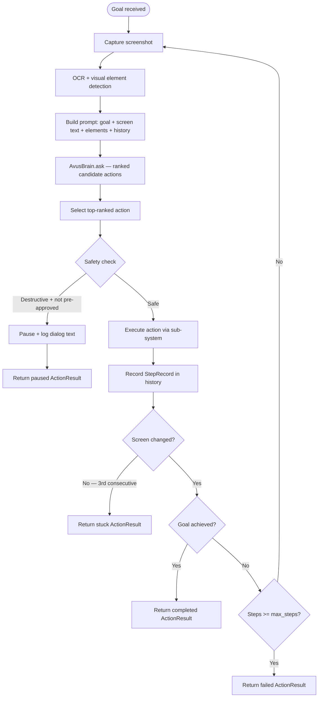

# Design Document: Janus Computer Use

## Overview

Janus Computer Use is a capability layer that gives the Janus autonomous worker the ability to interact with any Windows desktop application or website exactly as a human would. It closes the loop between Janus's existing screenshot capability and full input control: see the screen → understand what is shown → decide what to do → act with mouse and keyboard → observe the result → repeat.

The system is implemented as a Python module (`janus_computer_use.py`) that integrates cleanly with the existing `janus_autonomous_worker.py` and `janus_automation_platform.py` without requiring changes to their core logic. All components are async-compatible, using `asyncio.to_thread` to offload blocking OS calls.

### Key Design Decisions

- **Windows-only (win32)**: All OS interaction uses pyautogui, pygetwindow, and win32 APIs. No cross-platform abstraction layer is needed.
- **Library choices**: pyautogui (mouse/keyboard), pytesseract + Pillow (OCR/screenshots), pygetwindow (window management), opencv-python (template matching and visual detection).
- **AI planner uses Avus**: The `ActionPlanner` calls `AvusBrain.ask()` with a structured prompt containing a base64-encoded screenshot and goal description. A vision-capable model can be substituted by swapping the planner's model backend.
- **Async context manager**: `ComputerUseEngine` implements `__aenter__`/`__aexit__` so resources are properly initialised and released.
- **Safety-first**: Destructive action detection, stuck-state detection, and out-of-bounds clamping are built into the engine, not bolted on.

---

## Architecture



### Component Responsibilities

| Component | Responsibility |
|---|---|
| `ComputerUseEngine` | Top-level coordinator; async context manager; dependency check on import; action log; stuck-state detection; safety guards |
| `ActionPlanner` | Screenshot → AI analysis → ranked action list → execute → repeat loop |
| `MouseController` | Move, click (left/right/double), scroll, drag with smooth interpolation |
| `KeyboardController` | Type text, send key combinations, special keys, Unicode input, configurable speed |
| `ScreenReader` | Full/region screenshot capture, OCR with bounding boxes and confidence scores |
| `VisualDetector` | Template matching, UI element detection by type and label |
| `WindowManager` | List, focus, resize, move, minimise, maximise windows |
| `BrowserComputerUse` | High-level browser helper: login, search_jobs, apply_to_job, submit_work |
| `ActionLogger` | Persistent structured log with base64 thumbnail per entry |

---

## Components and Interfaces

### ComputerUseEngine

```python
class ComputerUseEngine:
    def __init__(self, context: Optional[Dict[str, Any]] = None): ...
    async def __aenter__(self) -> "ComputerUseEngine": ...
    async def __aexit__(self, *args) -> None: ...

    async def execute_action(self, action: Action) -> ActionResult: ...
    async def wait_for(self, condition: WaitCondition) -> ActionResult: ...
    async def run_goal(self, goal: str, max_steps: int = 50) -> ActionResult: ...

    # Sub-system accessors
    @property
    def mouse(self) -> MouseController: ...
    @property
    def keyboard(self) -> KeyboardController: ...
    @property
    def screen(self) -> ScreenReader: ...
    @property
    def vision(self) -> VisualDetector: ...
    @property
    def windows(self) -> WindowManager: ...
    @property
    def planner(self) -> ActionPlanner: ...
```

### MouseController

```python
class MouseController:
    async def move(self, x: int, y: int, human_like: bool = False) -> ActionResult: ...
    async def click(self, x: int, y: int, button: str = "left") -> ActionResult: ...
    async def double_click(self, x: int, y: int) -> ActionResult: ...
    async def right_click(self, x: int, y: int) -> ActionResult: ...
    async def scroll(self, x: int, y: int, direction: ScrollDirection, amount: int = 3) -> ActionResult: ...
    async def drag(self, src_x: int, src_y: int, dst_x: int, dst_y: int) -> ActionResult: ...
```

### KeyboardController

```python
class KeyboardController:
    def __init__(self, typing_speed_cps: float = 30.0): ...
    async def type_text(self, text: str) -> ActionResult: ...
    async def press_key(self, key: str) -> ActionResult: ...
    async def hotkey(self, *keys: str) -> ActionResult: ...
    async def key_combination(self, modifiers: List[str], key: str) -> ActionResult: ...
```

### ScreenReader

```python
class ScreenReader:
    async def capture(self, region: Optional[ScreenRegion] = None) -> Image.Image: ...
    async def ocr(self, image: Image.Image) -> List[OCRWord]: ...
    async def capture_and_ocr(self, region: Optional[ScreenRegion] = None) -> List[OCRWord]: ...
```

### VisualDetector

```python
class VisualDetector:
    async def find_element(self, label: str, screenshot: Image.Image) -> List[UIElement]: ...
    async def find_template(self, template: Image.Image, screenshot: Image.Image) -> Optional[UIElement]: ...
    async def find_by_type(self, element_type: str, screenshot: Image.Image) -> List[UIElement]: ...
    def center_of(self, element: UIElement) -> Tuple[int, int]: ...
```

### WindowManager

```python
class WindowManager:
    async def list_windows(self) -> List[WindowInfo]: ...
    async def focus(self, handle_or_title: Union[int, str]) -> ActionResult: ...
    async def resize(self, handle_or_title: Union[int, str], width: int, height: int) -> ActionResult: ...
    async def move(self, handle_or_title: Union[int, str], x: int, y: int) -> ActionResult: ...
    async def minimise(self, handle_or_title: Union[int, str]) -> ActionResult: ...
    async def maximise(self, handle_or_title: Union[int, str]) -> ActionResult: ...
```

### ActionPlanner

```python
class ActionPlanner:
    def __init__(self, engine: "ComputerUseEngine", brain: AvusBrain): ...
    async def plan_next(self, goal: str, screenshot: Image.Image, history: List[StepRecord]) -> List[CandidateAction]: ...
    async def run(self, goal: str, max_steps: int = 50) -> ActionResult: ...
```

### BrowserComputerUse

```python
class BrowserComputerUse:
    def __init__(self, engine: ComputerUseEngine, browser: str = "chrome"): ...
    async def open(self, url: str) -> ActionResult: ...
    async def login(self, username: str, password: str) -> ActionResult: ...
    async def search_jobs(self, query: str) -> List[Dict[str, Any]]: ...
    async def apply_to_job(self, job_url: str, cover_letter: str) -> ActionResult: ...
    async def submit_work(self, submission_url: str, content: str) -> ActionResult: ...
```

---

## Data Models

```python
from dataclasses import dataclass, field
from enum import Enum
from typing import Any, Dict, List, Optional, Tuple
from PIL import Image
import datetime

class ActionType(Enum):
    MOVE        = "move"
    CLICK       = "click"
    RIGHT_CLICK = "right_click"
    DOUBLE_CLICK= "double_click"
    TYPE        = "type"
    HOTKEY      = "hotkey"
    SCROLL      = "scroll"
    DRAG        = "drag"
    SCREENSHOT  = "screenshot"
    OCR         = "ocr"
    FIND_ELEMENT= "find_element"
    WAIT        = "wait"
    FOCUS_WINDOW= "focus_window"

class ScrollDirection(Enum):
    UP    = "up"
    DOWN  = "down"
    LEFT  = "left"
    RIGHT = "right"

class WaitConditionType(Enum):
    ELEMENT_VISIBLE = "element_visible"
    ELEMENT_GONE    = "element_gone"
    TEXT_PRESENT    = "text_present"
    TEXT_GONE       = "text_gone"
    IMAGE_PRESENT   = "image_present"

@dataclass
class ScreenRegion:
    x: int
    y: int
    width: int
    height: int

@dataclass
class UIElement:
    element_type: str          # "button", "input", "checkbox", etc.
    label: str
    bounding_box: ScreenRegion
    confidence: float          # 0.0 – 1.0
    center: Tuple[int, int]    # (cx, cy) — recommended click target

@dataclass
class OCRWord:
    text: str
    bounding_box: ScreenRegion
    confidence: float          # 0.0 – 1.0

@dataclass
class WaitCondition:
    condition_type: WaitConditionType
    target: str                # text string, element label, or template path
    timeout_seconds: float = 30.0   # max 300 s
    poll_interval_seconds: float = 0.5

@dataclass
class Action:
    action_type: ActionType
    params: Dict[str, Any]     # type-specific parameters
    pre_approved: bool = False # skip destructive-action safety check

@dataclass
class ActionResult:
    success: bool
    action_type: ActionType
    data: Optional[Any] = None          # returned payload (e.g. OCR words, element list)
    error_message: Optional[str] = None
    chars_delivered: Optional[int] = None  # for TYPE actions
    timestamp: datetime.datetime = field(default_factory=datetime.datetime.utcnow)

@dataclass
class CandidateAction:
    action: Action
    confidence: float
    rationale: str

@dataclass
class StepRecord:
    step_number: int
    action: Action
    result: ActionResult
    screenshot_before: str     # base64-encoded thumbnail
    screenshot_after: str      # base64-encoded thumbnail

@dataclass
class WindowInfo:
    handle: int
    title: str
    process_name: str
    bounding_box: ScreenRegion

@dataclass
class ActionLogEntry:
    action_type: str
    target: str
    timestamp: str             # ISO 8601
    outcome: str               # "success" | "failure"
    error_message: Optional[str]
    screenshot_thumbnail: str  # base64-encoded JPEG thumbnail
```

---

## ActionPlanner Loop

The planner implements a perceive → reason → act cycle:



### Prompt Structure

The planner sends the following structured prompt to `AvusBrain.ask()`:

```
GOAL: {goal}

CURRENT SCREEN (OCR text):
{ocr_text}

DETECTED ELEMENTS:
{element_list}

RECENT HISTORY (last 5 steps):
{history_summary}

Based on the above, list the top 3 actions to take next to achieve the goal.
For each action, provide: action_type, target, parameters, confidence (0-1), rationale.
Format as JSON array.
```

The response is parsed as a JSON array of `CandidateAction` objects. If parsing fails, the planner falls back to a screenshot-only re-prompt with a simpler format.

### Screen Change Detection

After each action, the planner captures a new screenshot and computes a pixel-difference hash (using `imagehash.phash` from the `imagehash` library). If the hash distance is below a threshold (≤ 5 bits), the screen is considered unchanged. Three consecutive unchanged screens trigger stuck-state detection.

---

## Integration Points with Existing Janus Modules

### janus_autonomous_worker.py

The worker imports `ComputerUseEngine` and uses it as an async context manager within job execution:

```python
from janus_computer_use import ComputerUseEngine

async def execute_job_with_computer_use(self, job: Job):
    context = {
        "job_id": job.id,
        "goal": job.description,
        "platform": job.platform,
    }
    async with ComputerUseEngine(context=context) as engine:
        result = await engine.run_goal(job.description)
        if result.success:
            await self.submit_work(job.id, result.data.get("summary", ""))
```

The `UpworkIntegration` class gains a fallback path: when `api_key` is `None`, it delegates to `BrowserComputerUse` instead of returning an empty list.

### janus_automation_platform.py

The automation engine adds a new `TaskType.COMPUTER_USE` handler:

```python
async def _handle_computer_use(self, config: Dict[str, Any]) -> Dict[str, Any]:
    from janus_computer_use import ComputerUseEngine
    async with ComputerUseEngine(context=config.get("context")) as engine:
        result = await engine.run_goal(config["goal"], max_steps=config.get("max_steps", 50))
        return {"success": result.success, "data": result.data, "error": result.error_message}
```

No changes are required to the existing task handler dispatch table — the new handler is registered alongside the existing ones.

### Structured Log Compatibility

`ActionLogger` emits events using the same `logging.getLogger("janus")` logger that the existing modules use, with a structured `extra` dict:

```python
logger.info("computer_use_action", extra={
    "event_type": "computer_use_action",
    "action_type": entry.action_type,
    "target": entry.target,
    "outcome": entry.outcome,
    "timestamp": entry.timestamp,
})
```

This ensures computer-use events appear in the same log stream as other Janus activities.

---

## Error Handling and Safety Mechanisms

### Dependency Check on Import

```python
_REQUIRED = ["pyautogui", "pytesseract", "PIL", "pygetwindow", "cv2"]

def _check_dependencies():
    missing = []
    for pkg in _REQUIRED:
        try:
            __import__(pkg)
        except ImportError:
            missing.append(pkg)
    if missing:
        raise ImportError(
            f"janus_computer_use requires: {', '.join(missing)}. "
            f"Install with: pip install {' '.join(missing)}"
        )
```

### Out-of-Bounds Coordinate Clamping

`MouseController` queries `pyautogui.size()` on initialisation to get `(screen_width, screen_height)`. Any coordinate outside `[0, screen_width) × [0, screen_height)` is rejected (click/move) or clamped (drag destination) before the OS call is made.

### Destructive Action Detection

Before executing any action, `ComputerUseEngine` checks the current screen for known destructive dialog patterns using OCR keyword matching:

- Keywords: `["delete", "remove", "uninstall", "format", "erase", "permanently", "cannot be undone"]`
- If a match is found and `action.pre_approved` is `False`, the engine pauses, logs the full dialog text, and returns a `ActionResult(success=False, error_message="Destructive action paused: <dialog text>")`.

### Stuck-State Detection

A rolling buffer of the last 3 screenshot hashes is maintained. If all 3 are within the similarity threshold, the engine returns a failed `ActionResult` with `error_message="Stuck state detected after 3 consecutive no-change actions"` and attaches the current screenshot.

### Error Dialog Recovery

After each action, the engine runs a lightweight OCR scan for common error dialog titles (`["Error", "Warning", "Exception", "Failed", "Access Denied"]`). If detected:
1. Attempt to dismiss by pressing `Escape` or clicking the first "OK"/"Close" button found.
2. Retry the previous action once.
3. If the dialog reappears, return a failed `ActionResult`.

### Unintended Navigation Detection

The `BrowserComputerUse` helper tracks the expected domain. After each navigation action, it reads the browser's address bar via OCR and compares the domain. If the domain does not match the expected one, it stops and returns a failed `ActionResult`.

### Action Timeout

Every `execute_action` call is wrapped in `asyncio.wait_for` with a configurable timeout (default 30 s). This prevents any single action from hanging indefinitely.

---

## Dependencies and Installation

### Python Packages

```
pyautogui>=0.9.54
pytesseract>=0.3.10
Pillow>=10.0.0
pygetwindow>=0.0.9
opencv-python>=4.8.0
imagehash>=4.3.1
```

### System Requirements

- **Windows 10/11** (win32 API)
- **Tesseract OCR engine** — must be installed separately:
  ```
  winget install UB-Mannheim.TesseractOCR
  ```
  The `pytesseract` wrapper auto-detects the default install path (`C:\Program Files\Tesseract-OCR\tesseract.exe`). A custom path can be set via `pytesseract.pytesseract.tesseract_cmd`.

### Installation

```bash
pip install pyautogui pytesseract Pillow pygetwindow opencv-python imagehash
winget install UB-Mannheim.TesseractOCR
```

### pyautogui Safety

pyautogui's `FAILSAFE` is enabled by default (moving the mouse to the top-left corner raises `FailSafeException`). The `ComputerUseEngine` catches this exception and returns a failed `ActionResult` rather than crashing.

---

## Correctness Properties

*A property is a characteristic or behavior that should hold true across all valid executions of a system — essentially, a formal statement about what the system should do. Properties serve as the bridge between human-readable specifications and machine-verifiable correctness guarantees.*

### Property 1: Out-of-bounds coordinates are always rejected

*For any* (x, y) coordinate pair where x < 0, y < 0, x ≥ screen_width, or y ≥ screen_height, calling `MouseController.click()` or `MouseController.move()` SHALL return a failed `ActionResult` and SHALL NOT issue any OS mouse event.

**Validates: Requirements 1.5**

---

### Property 2: Human-like movement visits intermediate points

*For any* source coordinate (x1, y1) and destination coordinate (x2, y2) where the distance is greater than 1 pixel, when `human_like=True` is requested, the sequence of cursor positions visited SHALL contain more than one point and each successive point SHALL be strictly closer to the destination than the previous point.

**Validates: Requirements 1.7**

---

### Property 3: Key combination ordering invariant

*For any* key combination with one or more modifier keys (Ctrl, Alt, Shift, Win) and a primary key, the sequence of key events issued SHALL press all modifier keys before the primary key, and release all modifier keys after the primary key, in reverse press order.

**Validates: Requirements 2.2**

---

### Property 4: Typing delivers all characters

*For any* non-empty string (including Unicode), calling `KeyboardController.type_text()` SHALL deliver every character in the string and SHALL return an `ActionResult` where `chars_delivered` equals the length of the input string.

**Validates: Requirements 2.1, 2.4, 2.7**

---

### Property 5: Configurable typing speed sets inter-key delay

*For any* typing speed value `s` (characters per second, s > 0), the inter-key delay used during `type_text()` SHALL equal 1/s seconds (within a 10% tolerance).

**Validates: Requirements 2.6**

---

### Property 6: Region capture returns correctly sized image

*For any* `ScreenRegion(x, y, width, height)` where the region is within display bounds, `ScreenReader.capture(region)` SHALL return a `PIL.Image` whose width equals `region.width` and whose height equals `region.height`.

**Validates: Requirements 3.2**

---

### Property 7: OCR confidence scores are always in [0.0, 1.0]

*For any* image passed to `ScreenReader.ocr()`, every `OCRWord` in the returned list SHALL have a `confidence` value in the closed interval [0.0, 1.0].

**Validates: Requirements 3.7**

---

### Property 8: Template matching returns correct position

*For any* template image embedded at a known position (tx, ty) within a larger screenshot, `VisualDetector.find_template()` SHALL return a `UIElement` whose `bounding_box` top-left corner is within 5 pixels of (tx, ty).

**Validates: Requirements 4.5**

---

### Property 9: Search results are sorted by confidence descending

*For any* call to `VisualDetector.find_element()` that returns two or more results, the `confidence` values in the returned list SHALL be non-increasing (i.e., result[i].confidence ≥ result[i+1].confidence for all i).

**Validates: Requirements 4.2**

---

### Property 10: UIElement center equals bounding box center

*For any* `UIElement` returned by `VisualDetector`, the `center` field SHALL equal `(bounding_box.x + bounding_box.width // 2, bounding_box.y + bounding_box.height // 2)`.

**Validates: Requirements 4.7**

---

### Property 11: Drag destination clamping stays within bounds

*For any* drag destination (dx, dy) where dx < 0, dy < 0, dx ≥ screen_width, or dy ≥ screen_height, the clamped destination used by `MouseController.drag()` SHALL satisfy 0 ≤ clamped_x < screen_width AND 0 ≤ clamped_y < screen_height.

**Validates: Requirements 6.4**

---

### Property 12: Window list contains all required fields

*For any* set of open windows, every `WindowInfo` returned by `WindowManager.list_windows()` SHALL have non-None values for `handle`, `title`, `process_name`, and `bounding_box`.

**Validates: Requirements 7.1**

---

### Property 13: Invalid window handles return failed ActionResult without exception

*For any* window handle value that does not correspond to an open window, all `WindowManager` operations (focus, resize, move, minimise, maximise) SHALL return a failed `ActionResult` and SHALL NOT raise an unhandled exception.

**Validates: Requirements 7.7**

---

### Property 14: Title pattern matching is case-insensitive substring

*For any* window title string T and search pattern P, `WindowManager` SHALL match T if and only if `P.lower()` is a substring of `T.lower()`.

**Validates: Requirements 7.8**

---

### Property 15: Planner step history length equals steps taken

*For any* goal execution session that runs N steps before terminating, the `ActionPlanner`'s step history SHALL contain exactly N `StepRecord` entries, each with non-None `action`, `result`, `screenshot_before`, and `screenshot_after` fields.

**Validates: Requirements 8.7**

---

### Property 16: Planner stops at max_steps

*For any* configurable `max_steps` value M and a goal that is never achieved, the `ActionPlanner` SHALL execute exactly M steps and then return a failed `ActionResult`.

**Validates: Requirements 8.5**

---

### Property 17: Candidate actions contain all required fields

*For any* call to `ActionPlanner.plan_next()`, every `CandidateAction` in the returned list SHALL have non-None values for `action.action_type`, `action.params`, `confidence` (in [0.0, 1.0]), and `rationale`.

**Validates: Requirements 8.2**

---

### Property 18: Stuck state detected after exactly 3 consecutive no-change screens

*For any* sequence of N consecutive actions that produce no screen change (N ≥ 3), the `ComputerUseEngine` SHALL detect the stuck state and return a failed `ActionResult` after the 3rd consecutive no-change action, not before and not after.

**Validates: Requirements 9.4**

---

### Property 19: Every action produces a log entry with all required fields

*For any* action executed by `ComputerUseEngine`, the `ActionLogger` SHALL write exactly one log entry containing non-None values for `action_type`, `target`, `timestamp`, `outcome`, and `screenshot_thumbnail` (valid base64-encoded string).

**Validates: Requirements 9.5, 9.6**

---

### Property 20: Missing dependency ImportError lists all missing packages

*For any* subset S of required packages that are absent from the environment, importing `janus_computer_use` SHALL raise an `ImportError` whose message contains the name of every package in S.

**Validates: Requirements 10.2**

---

### Property 21: Session context is accessible to ActionPlanner

*For any* context dictionary passed to `ComputerUseEngine.__init__()`, the `ActionPlanner` SHALL have access to the same dictionary (by reference or copy) during `plan_next()` calls within that session.

**Validates: Requirements 10.4**

---

### Property 22: Emitted log events contain required structure fields

*For any* action executed while `ComputerUseEngine` is running, the structured log event emitted SHALL contain the fields `event_type`, `action_type`, `target`, `outcome`, and `timestamp`.

**Validates: Requirements 10.6**

---

## Testing Strategy

### Dual Testing Approach

Both unit/example-based tests and property-based tests are used. Unit tests cover specific scenarios, integration points, and error conditions. Property tests verify universal invariants across randomised inputs.

### Property-Based Testing Library

**pytest-hypothesis** (Hypothesis for Python) is the chosen PBT library.

- Minimum **100 iterations** per property test (configured via `@settings(max_examples=100)`).
- Each property test is tagged with a comment referencing the design property:
  ```python
  # Feature: janus-computer-use, Property 1: Out-of-bounds coordinates are always rejected
  ```

### Unit Tests

Focused on:
- Specific click/keyboard/scroll/drag action sequences (Requirements 1–6)
- Window management operations (Requirement 7)
- ActionPlanner loop: success path, failure recovery, stuck state (Requirement 8–9)
- BrowserComputerUse high-level actions (Requirement 10.3)
- Async context manager lifecycle (Requirement 10.5)
- Error dialog detection and dismissal (Requirement 9.1)
- Destructive action pause behavior (Requirement 9.2)

All OS calls (pyautogui, pygetwindow, pytesseract, PIL screenshot) are mocked using `unittest.mock.patch` so tests run without a display.

### Integration Tests

- Import smoke test: verify `janus_computer_use` imports cleanly with all dependencies present (Requirement 10.1)
- Dependency check: verify `ImportError` is raised with correct message when packages are missing (Requirement 10.2)
- End-to-end goal execution against a real or virtual display (optional, requires Windows environment with display)

### Test File Structure

```
tests/
  test_mouse_controller.py       # Properties 1, 2, 11 + unit tests
  test_keyboard_controller.py    # Properties 3, 4, 5 + unit tests
  test_screen_reader.py          # Properties 6, 7 + unit tests
  test_visual_detector.py        # Properties 8, 9, 10 + unit tests
  test_window_manager.py         # Properties 12, 13, 14 + unit tests
  test_action_planner.py         # Properties 15, 16, 17 + unit tests
  test_computer_use_engine.py    # Properties 18, 19, 20, 21, 22 + unit tests
  test_browser_computer_use.py   # Unit tests for BrowserComputerUse
  test_integration.py            # Smoke + import tests
```
