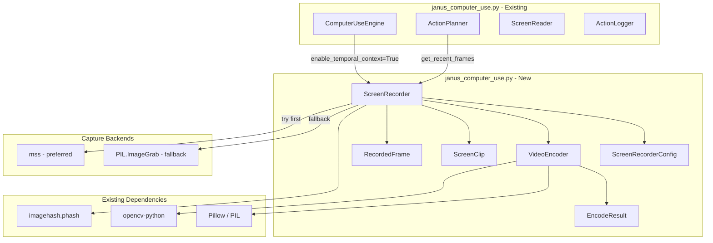
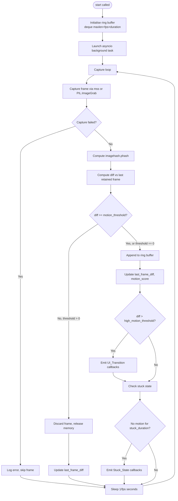

# Design Document: Janus Screen Recorder

## Overview

The Janus Screen Recorder extends `janus_computer_use.py` with a temporal video view of the screen. Instead of relying solely on single static screenshots, the `ScreenRecorder` component gives the AI a continuous, time-aware picture of what the screen has been doing — enabling it to detect UI transitions, identify stuck states, and reason about sequences of events rather than isolated moments.

The component is implemented as a new class within the existing `janus_computer_use.py` module. It integrates with the existing `ScreenReader`, `ActionPlanner`, and `ComputerUseEngine` classes without modifying their public APIs. All blocking capture and encoding calls are offloaded via `asyncio.to_thread`, consistent with the rest of the module.

### Key Design Decisions

- **Ring buffer via `collections.deque`**: The fixed-capacity circular buffer is implemented as `deque(maxlen=capacity)` where `capacity = capture_rate_fps * buffer_duration_seconds`. Python's deque automatically discards the oldest element when full, giving O(1) append and automatic eviction with no custom logic.
- **Dual capture backend**: `mss` is tried first (faster, lower CPU) and falls back to `PIL.ImageGrab` when `mss` is not installed. The fallback is transparent to callers.
- **Perceptual hashing for motion detection**: `imagehash.phash` (already a project dependency) computes a 64-bit hash per frame. The Hamming distance between consecutive hashes is the Frame_Diff. This is fast, robust to minor rendering noise, and produces values in the well-defined range [0, 64].
- **`VideoEncoder` as a separate class**: Encoding is isolated from capture so that the ring buffer is never blocked by a slow encode operation. Encoding always runs in `asyncio.to_thread`.
- **Minimal changes to existing classes**: `ComputerUseEngine` gains one constructor flag (`enable_temporal_context`) and one private attribute (`_screen_recorder`). `ActionPlanner.plan_next` gains an optional temporal context injection path that is skipped entirely when the recorder is absent.
- **Config immutability at runtime**: All parameters are validated at construction time and stored in a `ScreenRecorderConfig` dataclass. Attempting to change them while the recorder is running raises `RuntimeError`.

---

## Architecture



### Component Responsibilities

| Component | Responsibility |
|---|---|
| `ScreenRecorderConfig` | Validated dataclass holding all configuration parameters with defaults |
| `RecordedFrame` | Single captured frame: PIL image, timestamp, phash |
| `ScreenClip` | Contiguous sequence of frames with metadata and optional warning |
| `EncodeResult` | Outcome of an encode operation: success flag, output path, file size, error |
| `ScreenRecorder` | Background capture loop, ring buffer, motion detection, event callbacks, clip extraction |
| `VideoEncoder` | Async MP4 and GIF encoding from a `ScreenClip` |

---

## Components and Interfaces

### ScreenRecorderConfig

```python
@dataclass
class ScreenRecorderConfig:
    capture_rate_fps: int = 5
    buffer_duration_seconds: int = 30
    motion_threshold: int = 5
    high_motion_threshold: int = 20
    stuck_duration_seconds: int = 10
    transition_settling_seconds: float = 1.5
    temporal_context_frames: int = 3
    gif_max_dimension: int = 640
```

Validation rules (enforced in `__post_init__`):

| Parameter | Min | Max |
|---|---|---|
| `capture_rate_fps` | 1 | 30 |
| `buffer_duration_seconds` | 5 | 300 |
| `motion_threshold` | 0 | 64 |
| `high_motion_threshold` | 1 | 64 |
| `stuck_duration_seconds` | 1 | 3600 |
| `transition_settling_seconds` | 0.1 | 60.0 |
| `temporal_context_frames` | 1 | 10 |
| `gif_max_dimension` | 64 | 4096 |

### RecordedFrame

```python
@dataclass
class RecordedFrame:
    image: Any          # PIL.Image.Image
    timestamp: float    # time.monotonic() at capture
    phash: Any          # imagehash.ImageHash
```

### ScreenClip

```python
@dataclass
class ScreenClip:
    frames: List[RecordedFrame]
    start_time: float
    end_time: float
    warning: Optional[str] = None

    @property
    def frame_count(self) -> int:
        return len(self.frames)
```

### EncodeResult

```python
@dataclass
class EncodeResult:
    success: bool
    output_path: Optional[str] = None
    file_size_bytes: int = 0
    error_message: Optional[str] = None
```

### ScreenRecorder

```python
class ScreenRecorder:
    def __init__(
        self,
        capture_rate_fps: int = 5,
        buffer_duration_seconds: int = 30,
        motion_threshold: int = 5,
        high_motion_threshold: int = 20,
        stuck_duration_seconds: int = 10,
        transition_settling_seconds: float = 1.5,
        temporal_context_frames: int = 3,
        gif_max_dimension: int = 640,
    ) -> None: ...

    # Lifecycle
    async def start(self) -> None: ...
    async def stop(self) -> None: ...
    async def __aenter__(self) -> "ScreenRecorder": ...
    async def __aexit__(self, *args) -> None: ...

    # Clip extraction
    async def get_clip(self, start_time: float, end_time: float) -> ScreenClip: ...
    async def get_recent_frames(self, n: int) -> List[RecordedFrame]: ...

    # Properties
    @property
    def last_frame_diff(self) -> int: ...          # most recent phash distance, 0 if no frames yet
    @property
    def motion_score(self) -> float: ...           # rolling sum of diffs over last 5 s
    @property
    def config(self) -> Dict[str, Any]: ...        # all config params as dict
    @property
    def is_running(self) -> bool: ...

    # Event registration
    def on_ui_transition(self, callback: Callable) -> None: ...
    def on_stuck_state(self, callback: Callable) -> None: ...
```

### VideoEncoder

```python
class VideoEncoder:
    async def encode_mp4(
        self,
        clip: ScreenClip,
        output_path: str,
    ) -> EncodeResult: ...

    async def encode_gif(
        self,
        clip: ScreenClip,
        output_path: str,
        max_dimension: int = 640,
    ) -> EncodeResult: ...
```

### ComputerUseEngine changes

```python
class ComputerUseEngine:
    def __init__(
        self,
        context: Optional[Dict[str, Any]] = None,
        enable_temporal_context: bool = False,   # NEW
    ) -> None: ...

    # NEW accessor
    @property
    def recorder(self) -> Optional[ScreenRecorder]: ...
```

In `__aenter__`: if `enable_temporal_context` is `True`, instantiate and `await recorder.start()`.
In `__aexit__`: if `_screen_recorder` is not `None`, `await recorder.stop()`.

### ActionPlanner changes

`plan_next` gains an optional temporal context injection path:

```python
async def plan_next(
    self,
    goal: str,
    screenshot: Any,
    history: List[StepRecord],
) -> List[CandidateAction]:
    # ... existing OCR + element detection ...

    # NEW: inject temporal context if recorder is available
    temporal_section = ""
    engine = self._engine
    if getattr(engine, "_screen_recorder", None) is not None:
        recorder = engine._screen_recorder
        if recorder.is_running:
            n = engine._config.temporal_context_frames  # from ScreenRecorderConfig
            recent = await recorder.get_recent_frames(n)
            if recent:
                temporal_section = _build_temporal_context_section(recent, recorder)

    # ... build prompt with temporal_section appended ...
```

`_build_temporal_context_section` encodes each frame as a base64 JPEG thumbnail (max 320×240 px) and includes the relative timestamp (seconds before now) and a motion summary line.

---

## Data Models

```python
import time
from collections import deque
from dataclasses import dataclass, field
from typing import Any, Callable, Dict, List, Optional

@dataclass
class ScreenRecorderConfig:
    capture_rate_fps: int = 5
    buffer_duration_seconds: int = 30
    motion_threshold: int = 5
    high_motion_threshold: int = 20
    stuck_duration_seconds: int = 10
    transition_settling_seconds: float = 1.5
    temporal_context_frames: int = 3
    gif_max_dimension: int = 640

    def __post_init__(self) -> None:
        _validate_range("capture_rate_fps", self.capture_rate_fps, 1, 30)
        _validate_range("buffer_duration_seconds", self.buffer_duration_seconds, 5, 300)
        _validate_range("motion_threshold", self.motion_threshold, 0, 64)
        _validate_range("high_motion_threshold", self.high_motion_threshold, 1, 64)
        _validate_range("stuck_duration_seconds", self.stuck_duration_seconds, 1, 3600)
        _validate_range("transition_settling_seconds", self.transition_settling_seconds, 0.1, 60.0)
        _validate_range("temporal_context_frames", self.temporal_context_frames, 1, 10)
        _validate_range("gif_max_dimension", self.gif_max_dimension, 64, 4096)

    @property
    def buffer_capacity(self) -> int:
        return self.capture_rate_fps * self.buffer_duration_seconds


def _validate_range(name: str, value, min_val, max_val) -> None:
    if not (min_val <= value <= max_val):
        raise ValueError(
            f"ScreenRecorder: '{name}' must be in [{min_val}, {max_val}], got {value!r}"
        )


@dataclass
class RecordedFrame:
    image: Any          # PIL.Image.Image
    timestamp: float    # time.monotonic() at capture
    phash: Any          # imagehash.ImageHash


@dataclass
class ScreenClip:
    frames: List[RecordedFrame]
    start_time: float
    end_time: float
    warning: Optional[str] = None

    @property
    def frame_count(self) -> int:
        return len(self.frames)


@dataclass
class EncodeResult:
    success: bool
    output_path: Optional[str] = None
    file_size_bytes: int = 0
    error_message: Optional[str] = None
```

---

## Capture Loop Design



### Ring Buffer Capacity

```
capacity = capture_rate_fps × buffer_duration_seconds
```

With defaults (5 fps, 30 s): capacity = 150 frames. At 1920×1080 RGBA (≈8 MB per frame uncompressed), this is ~1.2 GB worst case. In practice, PIL stores images in compressed internal format and motion filtering discards most frames during idle periods, keeping memory well below this ceiling.

### Capture Backend Selection

```python
try:
    import mss
    _CAPTURE_BACKEND = "mss"
except ImportError:
    _CAPTURE_BACKEND = "pil"
```

The backend is selected once at module load time. `mss` is preferred because it uses the Windows GDI BitBlt API directly, which is significantly faster than `PIL.ImageGrab.grab` (which goes through the clipboard). Both return a `PIL.Image` so the rest of the pipeline is backend-agnostic.

---

## VideoEncoder Design

### MP4 Encoding

```python
async def encode_mp4(self, clip: ScreenClip, output_path: str) -> EncodeResult:
    if not clip.frames:
        return EncodeResult(success=False, error_message="Cannot encode empty clip")

    def _encode():
        # Compute fps from frame timestamps
        if len(clip.frames) >= 2:
            duration = clip.frames[-1].timestamp - clip.frames[0].timestamp
            fps = len(clip.frames) / duration if duration > 0 else 5.0
        else:
            fps = 5.0

        w, h = clip.frames[0].image.size
        fourcc = cv2.VideoWriter_fourcc(*"mp4v")
        writer = cv2.VideoWriter(output_path, fourcc, fps, (w, h))
        try:
            for frame in clip.frames:
                arr = cv2.cvtColor(np.array(frame.image), cv2.COLOR_RGB2BGR)
                writer.write(arr)
        finally:
            writer.release()

    try:
        await asyncio.to_thread(_encode)
        size = os.path.getsize(output_path)
        return EncodeResult(success=True, output_path=output_path, file_size_bytes=size)
    except Exception as exc:
        # Clean up partial file
        if os.path.exists(output_path):
            os.remove(output_path)
        return EncodeResult(success=False, error_message=str(exc))
```

### GIF Encoding

```python
async def encode_gif(self, clip: ScreenClip, output_path: str, max_dimension: int = 640) -> EncodeResult:
    if not clip.frames:
        return EncodeResult(success=False, error_message="Cannot encode empty clip")

    def _encode():
        images = []
        for frame in clip.frames:
            img = frame.image.copy()
            # Scale to max_dimension on longest side
            w, h = img.size
            if max(w, h) > max_dimension:
                scale = max_dimension / max(w, h)
                img = img.resize((int(w * scale), int(h * scale)), Image.LANCZOS)
            images.append(img.convert("P", palette=Image.ADAPTIVE))

        # Compute per-frame duration in ms from timestamps
        durations = []
        for i in range(len(clip.frames)):
            if i + 1 < len(clip.frames):
                d = int((clip.frames[i + 1].timestamp - clip.frames[i].timestamp) * 1000)
            else:
                d = 200  # default 200 ms for last frame
            durations.append(max(20, d))  # GIF minimum frame delay is 20 ms

        images[0].save(
            output_path,
            save_all=True,
            append_images=images[1:],
            loop=0,
            duration=durations,
        )

    try:
        await asyncio.to_thread(_encode)
        size = os.path.getsize(output_path)
        return EncodeResult(success=True, output_path=output_path, file_size_bytes=size)
    except Exception as exc:
        if os.path.exists(output_path):
            os.remove(output_path)
        return EncodeResult(success=False, error_message=str(exc))
```

---

## Temporal Context Injection

When `enable_temporal_context=True`, `ActionPlanner.plan_next` appends a temporal context section to the prompt:

```
TEMPORAL CONTEXT (last {n} frames):
  Frame -2.3s: [base64 JPEG thumbnail]
  Frame -1.1s: [base64 JPEG thumbnail]
  Frame -0.0s: [base64 JPEG thumbnail]

MOTION SUMMARY:
  Current frame diff: 12 bits
  Motion score (5s window): 47.3
  Last UI transition: 3.2s ago
```

Each thumbnail is a 320×240 JPEG encoded as base64. The relative timestamp is `now - frame.timestamp` in seconds, formatted to one decimal place.

If the recorder is `None`, not running, or the buffer is empty, this section is omitted entirely and no exception is raised.

---

## Error Handling

### Capture Failures

If a frame capture raises any exception, the error is logged at WARNING level, the frame is skipped, and the capture loop continues after the normal sleep interval. The ring buffer is not modified.

### Callback Exceptions

If a registered `on_ui_transition` or `on_stuck_state` callback raises an exception, the exception is caught, logged at ERROR level, and the capture loop continues. Other registered callbacks for the same event are still called.

### Encode Failures

If encoding fails at any point, the partial output file is deleted (if it exists) and an `EncodeResult(success=False, error_message=...)` is returned. No exception propagates to the caller.

### Background Task Crash

If the background capture task raises an unhandled exception (beyond per-frame errors), `ScreenRecorder` logs the exception, attempts to restart the task once, and emits a `Stuck_State` event if the restart also fails.

### Config Validation

All parameter validation happens in `ScreenRecorderConfig.__post_init__`. A `ValueError` with a descriptive message (parameter name and valid range) is raised immediately at construction time, before any resources are allocated.

### mss Unavailability

`mss` is imported at module load time inside a `try/except ImportError`. If absent, a `logging.warning` is emitted and `PIL.ImageGrab` is used. No `ImportError` is raised. The existing `_check_dependencies()` function is not modified.

---

## Correctness Properties

*A property is a characteristic or behavior that should hold true across all valid executions of a system — essentially, a formal statement about what the system should do. Properties serve as the bridge between human-readable specifications and machine-verifiable correctness guarantees.*

### Property 1: Ring buffer never exceeds capacity

*For any* sequence of frame additions of length N (where N > capacity), the ring buffer length SHALL never exceed `capture_rate_fps × buffer_duration_seconds` at any point during or after the additions.

**Validates: Requirements 1.2, 1.3**

---

### Property 2: Frame diff is always in [0, 64]

*For any* two PIL images passed to the phash-based diff computation, the resulting Frame_Diff value SHALL be an integer in the closed interval [0, 64].

**Validates: Requirements 3.1, 3.6**

---

### Property 3: Frames returned by get_clip are in chronological order

*For any* ring buffer contents and any (start_time, end_time) interval, the frames returned by `get_clip` SHALL be sorted in ascending order by timestamp (i.e., `frames[i].timestamp <= frames[i+1].timestamp` for all i).

**Validates: Requirements 2.1, 2.5**

---

### Property 4: Motion threshold=0 retains every frame

*For any* sequence of captured frames and any pair of consecutive frames (regardless of their visual similarity), when `motion_threshold=0`, every frame SHALL be appended to the ring buffer without being discarded.

**Validates: Requirements 3.4, 3.5**

---

### Property 5: Config validation rejects out-of-range values

*For any* parameter value that falls outside its documented valid range, constructing a `ScreenRecorderConfig` (or `ScreenRecorder`) with that value SHALL raise a `ValueError` whose message contains the parameter name and the valid range.

**Validates: Requirements 8.2**

---

### Property 6: EncodeResult on empty clip is always failure

*For any* `ScreenClip` with zero frames, calling either `VideoEncoder.encode_mp4` or `VideoEncoder.encode_gif` SHALL return an `EncodeResult` with `success=False` and a non-empty `error_message`, and SHALL NOT create any file at the specified output path.

**Validates: Requirements 4.8**

---

### Property 7: get_recent_frames(n) returns at most n frames

*For any* ring buffer state and any positive integer n, `get_recent_frames(n)` SHALL return a list of length at most n (it may return fewer if the buffer contains fewer than n frames).

**Validates: Requirements 6.1**

---

### Property 8: Temporal context thumbnails are valid base64

*For any* `RecordedFrame` with a valid PIL image, encoding it as a temporal context thumbnail SHALL produce a string that is valid base64 and that decodes to a non-empty JPEG byte sequence.

**Validates: Requirements 6.2**

---

## Testing Strategy

### Dual Testing Approach

Both unit/example-based tests and property-based tests are used. Unit tests cover specific scenarios, integration points, and error conditions. Property tests verify universal invariants across randomised inputs.

### Property-Based Testing Library

**pytest-hypothesis** (Hypothesis for Python) is the chosen PBT library, consistent with the existing `janus-computer-use` test suite.

- Minimum **100 iterations** per property test (configured via `@settings(max_examples=100)`).
- Each property test is tagged with a comment referencing the design property:
  ```python
  # Feature: janus-screen-recorder, Property N: <title>
  ```

### Unit Tests

Focused on:
- `ScreenRecorderConfig` validation (all parameters, boundary values)
- `ScreenRecorder` lifecycle: `start()`, `stop()`, context manager
- Ring buffer behaviour: capacity, eviction, concurrent access
- Motion detection: threshold filtering, high-motion event emission
- Stuck-state detection: duration tracking, callback invocation
- `VideoEncoder`: MP4 and GIF encoding with mocked `cv2` and `PIL`
- `ActionPlanner` temporal context injection: with and without recorder
- `ComputerUseEngine` integration: `enable_temporal_context` flag

All blocking OS calls (screen capture, file I/O, `cv2.VideoWriter`) are mocked via `unittest.mock.patch` so tests run without a display or codec.

### Integration Tests

- Import smoke test: verify `ScreenRecorder` is importable from `janus_computer_use`
- `mss` fallback: verify `PIL.ImageGrab` is used when `mss` is absent
- `ComputerUseEngine` lifecycle with `enable_temporal_context=True`: verify recorder starts and stops with the engine

### Test File Structure

```
tests/
  test_screen_recorder.py        # Properties 1, 2, 3, 4, 5, 7 + unit tests
  test_video_encoder.py          # Properties 6 + unit tests
  test_temporal_context.py       # Property 8 + unit tests for ActionPlanner injection
  test_screen_recorder_engine.py # Integration: ComputerUseEngine + ScreenRecorder lifecycle
```
