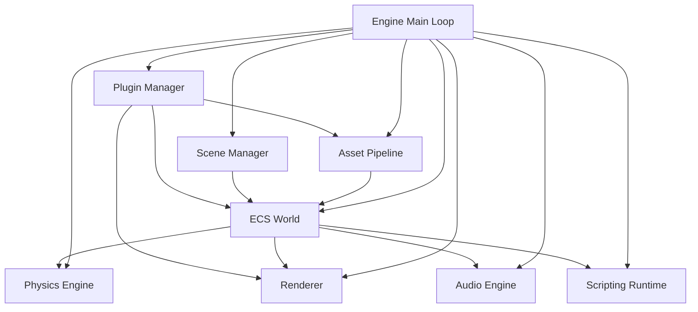

# Design Document: OSS Game Engine

## Overview

The OSS Game Engine is a fully self-contained, open-source game engine implemented entirely as original, synthetic code. It targets 2D and 3D game development and is designed to surpass existing engines in developer experience, performance, and extensibility. Every subsystem — renderer, physics, audio, scripting, asset pipeline, editor, and build system — is written from scratch with zero runtime or build-time dependency on external libraries, SDKs, API keys, or network services.

The engine is written in Rust, chosen for its memory safety guarantees, zero-cost abstractions, and excellent support for systems programming without a garbage collector. The entire codebase compiles from a single `cargo build` invocation on an air-gapped machine with only the Rust toolchain installed.

### Design Principles

- **Zero external dependencies**: No crates.io packages, no vendored third-party code, no downloaded binaries. All code is original.
- **Data-oriented design**: ECS architecture ensures cache-friendly memory layouts and predictable performance.
- **Offline-first**: No network calls at any stage — build, runtime, or editor.
- **Correctness by construction**: Serialization formats are self-defined and round-trip safe. The scripting language is statically typed.
- **Layered architecture**: Each subsystem exposes a clean interface; subsystems communicate through well-defined APIs, not global state.

---

## Architecture

The engine is organized as a set of cooperating subsystems coordinated by a central `Engine` struct. The main loop drives frame execution, dispatching to each subsystem in a defined order.



### Frame Execution Order

Each frame executes in the following sequence:

1. **Input polling** — collect OS window events
2. **Asset hot-reload check** — detect file changes, trigger reloads
3. **Script `on_update`** — run all active script update functions
4. **System dispatch** — execute registered ECS Systems in registration order
5. **Physics tick** — advance fixed-timestep physics simulation (may run 0 or N sub-steps)
6. **Audio mix** — mix active audio sources and submit to device
7. **Render** — cull, sort, and submit draw calls; present frame
8. **Editor tick** (editor builds only) — update editor UI and inspector

### Crate Structure

```
oss-game-engine/
├── engine-core/        # ECS, scene management, serializer, plugin API
├── engine-renderer/    # Renderer abstraction + Vulkan/Metal/DX12/WebGPU backends
├── engine-physics/     # Rigid body simulation, collision detection
├── engine-audio/       # PCM/OGG decoding, mixing, spatialization
├── engine-scripting/   # Lexer, parser, type checker, bytecode compiler, VM
├── engine-assets/      # Asset pipeline, hot-reload, content-addressable cache
├── engine-editor/      # Scene editor UI, inspector, undo/redo
├── engine-build/       # Build system, platform targets, incremental compilation
└── engine-runtime/     # Main loop, platform entry points
```

Each crate depends only on crates within this workspace. No external registry dependencies.

---

## Components and Interfaces

### ECS World

The `World` struct is the central ECS container. It owns all entity and component storage.

```rust
pub struct World {
    entities: EntityAllocator,
    components: ComponentRegistry,
    systems: SystemScheduler,
}

pub struct EntityId(u64); // generation-tagged index

pub trait Component: 'static + Send + Sync {}

pub trait System: 'static + Send + Sync {
    fn run(&mut self, world: &mut World, delta: f32);
}
```

Component storage uses a sparse-set layout per component type, providing O(1) insert/remove and contiguous iteration. Each component type gets its own `ComponentStorage<T>` backed by a `Vec<T>` (dense array) and a sparse index array mapping `EntityId` to dense index.

```rust
pub struct ComponentStorage<T: Component> {
    dense: Vec<T>,
    dense_ids: Vec<EntityId>,
    sparse: Vec<Option<usize>>, // indexed by entity index
}
```

The `SystemScheduler` maintains a registration-ordered list of boxed `System` trait objects. Concurrent mutation of the same component type is prevented by a borrow-checked access declaration system: each system declares its read/write component sets at registration time, and the scheduler serializes systems with conflicting write sets.

### Scene Manager

```rust
pub struct SceneManager {
    active_scenes: Vec<Scene>,
    pending_load: Option<SceneLoadRequest>,
    pending_unload: Option<SceneId>,
}

pub struct Scene {
    id: SceneId,
    name: String,
    entities: Vec<EntityId>,
    metadata: SceneMetadata,
}

pub enum SceneLoadRequest {
    Replace(PathBuf),
    Additive(PathBuf),
}
```

Scene files use the engine's own text format (described in Data Models). The `SceneSerializer` handles encode/decode. Malformed files produce a `SceneError::ParseError { path, field, reason }` and no partial scene is instantiated.

### Renderer

The renderer uses a backend abstraction trait:

```rust
pub trait GfxBackend: Send + Sync {
    fn begin_frame(&mut self);
    fn submit_draw_call(&mut self, call: DrawCall);
    fn end_frame(&mut self);
    fn resize_viewport(&mut self, width: u32, height: u32);
    fn compile_shader(&mut self, source: &ShaderSource) -> Result<ShaderId, ShaderError>;
}
```

Concrete implementations: `VulkanBackend`, `MetalBackend`, `Dx12Backend`, `WebGpuBackend`. The active backend is selected at startup based on the target platform.

The render pipeline:
1. **Visibility culling** — frustum cull against scene AABB tree
2. **Sort** — sort draw calls by material ID (minimizes GPU state changes)
3. **Deferred pass** — G-buffer fill for scenes with >8 dynamic lights
4. **Forward pass** — direct shading for simpler scenes
5. **Post-process** — tone mapping, FXAA
6. **Present**

PBR shading uses the Cook-Torrance BRDF with GGX normal distribution, Smith geometry function, and Fresnel-Schlick approximation — all implemented as original GLSL/WGSL/HLSL/MSL shader source embedded in the crate.

### Physics Engine

```rust
pub struct PhysicsWorld {
    bodies: Vec<RigidBody>,
    colliders: Vec<Collider>,
    broadphase: AabbTree,
    narrowphase: NarrowPhase,
    constraints: Vec<Constraint>,
    world_bounds: Aabb,
}

pub enum ColliderShape {
    Sphere { radius: f32 },
    Aabb { half_extents: Vec3 },
    Obb { half_extents: Vec3, orientation: Quat },
    Capsule { radius: f32, half_height: f32 },
    ConvexHull { vertices: Vec<Vec3> },
}
```

The physics loop runs at a fixed 60 Hz timestep using a semi-implicit Euler integrator. Broadphase uses a dynamic AABB tree (BVH). Narrowphase uses GJK + EPA for convex shapes and SAT for AABB/OBB pairs. Collision resolution applies sequential impulses.

### Audio Engine

```rust
pub struct AudioEngine {
    mixer: Mixer,
    sources: Vec<AudioSource>,
    listener: ListenerState,
    output_buffer: Vec<f32>, // interleaved stereo, 44100 Hz
}

pub struct AudioSource {
    clip: Arc<AudioClip>,
    position: Vec3,
    max_range: f32,
    volume: f32,
    state: PlaybackState,
}
```

PCM/WAV decoding reads the RIFF header and raw sample data directly. OGG Vorbis decoding implements the Vorbis I specification from scratch (floor, residue, mapping, mode decode). The mixer accumulates up to 64 active sources per frame into the output buffer. Spatialization uses inverse-square-law attenuation and linear panning based on azimuth angle.

### Scripting Runtime

```rust
pub struct ScriptingRuntime {
    compiler: Compiler,
    vm: VirtualMachine,
    bytecode_cache: HashMap<PathBuf, CachedBytecode>,
}

pub struct Compiler {
    lexer: Lexer,
    parser: Parser,
    type_checker: TypeChecker,
    codegen: BytecodeGen,
}

pub struct VirtualMachine {
    call_stack: Vec<CallFrame>,
    heap: Heap,
    ecs_bridge: EcsBridge,
}
```

The scripting language (working name: **Loom**) is statically typed with type inference. It compiles to a register-based bytecode executed by the VM. The `EcsBridge` exposes `world.query<T>()`, `entity.add<T>(component)`, and `entity.remove<T>()` to scripts.

The `Parser` produces an `Ast` (abstract syntax tree). The `PrettyPrinter` formats an `Ast` back to canonical source text. The round-trip property (parse → pretty-print → parse → equivalent AST) is a core correctness invariant.

### Asset Pipeline

```rust
pub struct AssetPipeline {
    importers: HashMap<&'static str, Box<dyn AssetImporter>>,
    cache: ContentAddressableCache,
    watcher: FileWatcher,
}

pub trait AssetImporter: Send + Sync {
    fn extensions(&self) -> &[&'static str];
    fn import(&self, path: &Path, data: &[u8]) -> Result<AssetData, ImportError>;
}
```

Built-in importers: `PngImporter`, `JpegImporter`, `WebpImporter`, `GltfImporter`, `WavImporter`, `OggImporter`, `ScriptImporter`. All format parsing is original code.

The `ContentAddressableCache` stores processed assets keyed by `blake3(file_contents)` (Blake3 implemented as original code). The `FileWatcher` polls `mtime` on a background thread every 100ms, emitting `AssetChanged` events.

### Scene Editor

```rust
pub struct Editor {
    viewport: EditorViewport,
    hierarchy: HierarchyPanel,
    inspector: InspectorPanel,
    undo_stack: UndoStack,
    auto_save: AutoSave,
}

pub struct UndoStack {
    history: VecDeque<EditorCommand>,
    redo_stack: Vec<EditorCommand>,
    max_history: usize, // 100
}
```

The editor UI is rendered using the engine's own immediate-mode UI layer (original code, no external UI framework). The `AutoSave` writes a recovery file every 30 seconds. On startup, if a recovery file newer than the project file exists, the editor offers to restore it.

### Plugin System

```rust
pub trait Plugin: Send + Sync {
    fn on_register(&mut self, api: &mut PluginApi);
    fn on_unregister(&mut self, api: &mut PluginApi);
}

pub struct PluginApi<'a> {
    world: &'a mut World,
    renderer: &'a mut dyn GfxBackend,
    asset_pipeline: &'a mut AssetPipeline,
    editor: Option<&'a mut Editor>,
}
```

Plugins are loaded as dynamic libraries (`.so`/`.dll`/`.dylib`). The engine validates the plugin's declared API version before calling `on_register`. Any plugin that registers a network socket or calls an OS networking syscall is detected via a syscall audit hook and rejected.

### Build System

```rust
pub struct BuildSystem {
    target: Platform,
    project: ProjectManifest,
    incremental_cache: IncrementalCache,
}

pub enum Platform {
    WindowsX64,
    MacosArm64,
    MacosX64,
    LinuxX64,
    WebWasm,
    Ios,
    Android,
}
```

The build system invokes the local Rust toolchain (or Emscripten for WASM) via `std::process::Command`. It tracks file hashes for incremental builds. For Web targets, it produces `index.html`, `game.wasm`, and `loader.js` — all self-contained with no CDN references.

---

## Data Models

### Entity ID

```rust
/// Generation-tagged entity identifier.
/// Upper 32 bits: generation counter (detects use-after-free).
/// Lower 32 bits: index into sparse array.
pub struct EntityId(u64);
```

### Scene File Format

Scene files use a custom text format called **KiroScene** (`.ks`). It is human-readable, line-oriented, and unambiguous.

```
scene "level_01" version 1
  entity 1
    transform position 0.0 1.0 0.0 rotation 0.0 0.0 0.0 1.0 scale 1.0 1.0 1.0
    mesh_renderer mesh "assets/cube.glb" material "assets/stone.mat"
  entity 2
    transform position 5.0 0.0 0.0 rotation 0.0 0.0 0.0 1.0 scale 1.0 1.0 1.0
    rigid_body mass 1.0 linear_damping 0.1
    collider sphere radius 0.5
```

Grammar (EBNF):

```
scene_file   = "scene" STRING "version" INT newline entity*
entity       = "entity" INT newline component*
component    = IDENT field* newline
field        = IDENT value
value        = FLOAT | INT | STRING | vec3 | quat
vec3         = FLOAT FLOAT FLOAT
quat         = FLOAT FLOAT FLOAT FLOAT
```

### Asset Metadata Format

Asset metadata files (`.kmeta`) use the same KiroScene text format conventions:

```
asset version 1
  type texture
  source_path "assets/stone.png"
  content_hash "a3f9c2..."
  width 512
  height 512
  format rgba8
```

### Loom Script AST (abbreviated)

```rust
pub enum Expr {
    Literal(Literal),
    Ident(String),
    BinOp { op: BinOp, lhs: Box<Expr>, rhs: Box<Expr> },
    Call { callee: Box<Expr>, args: Vec<Expr> },
    FieldAccess { object: Box<Expr>, field: String },
    If { cond: Box<Expr>, then_block: Block, else_block: Option<Block> },
}

pub enum Stmt {
    Let { name: String, ty: Option<Type>, init: Expr },
    Assign { target: Expr, value: Expr },
    Return(Option<Expr>),
    Expr(Expr),
    While { cond: Expr, body: Block },
}

pub struct FnDecl {
    pub name: String,
    pub params: Vec<(String, Type)>,
    pub return_ty: Type,
    pub body: Block,
}
```

### Bytecode Instruction Set

```rust
pub enum Opcode {
    LoadConst(u16),   // push constant pool[u16]
    LoadLocal(u8),    // push locals[u8]
    StoreLocal(u8),   // pop -> locals[u8]
    Add, Sub, Mul, Div, Mod,
    Eq, Ne, Lt, Le, Gt, Ge,
    And, Or, Not,
    Jump(i16),        // unconditional relative jump
    JumpIfFalse(i16), // conditional relative jump
    Call(u8),         // call with u8 arg count
    Return,
    GetComponent(u16),  // ECS bridge: get component type[u16] from entity
    SetComponent(u16),
    RemoveComponent(u16),
}
```

### Render Draw Call

```rust
pub struct DrawCall {
    pub mesh_id: MeshId,
    pub material_id: MaterialId,
    pub transform: Mat4,
    pub sort_key: u64, // packed: material_id | depth
}
```

### Physics Rigid Body

```rust
pub struct RigidBody {
    pub position: Vec3,
    pub orientation: Quat,
    pub linear_velocity: Vec3,
    pub angular_velocity: Vec3,
    pub mass: f32,
    pub inv_mass: f32,
    pub inertia_tensor: Mat3,
    pub linear_damping: f32,
    pub angular_damping: f32,
    pub is_frozen: bool,
}
```

### Audio Clip

```rust
pub struct AudioClip {
    pub samples: Vec<f32>,  // normalized [-1.0, 1.0], interleaved stereo
    pub sample_rate: u32,
    pub channels: u8,
}
```

---

## Correctness Properties

*A property is a characteristic or behavior that should hold true across all valid executions of a system — essentially, a formal statement about what the system should do. Properties serve as the bridge between human-readable specifications and machine-verifiable correctness guarantees.*

---

### Property 1: System Execution Order

*For any* sequence of registered Systems, the ECS scheduler SHALL execute them in exactly the order they were registered, with no reordering.

**Validates: Requirements 1.2**

---

### Property 2: Component Query Completeness

*For any* set of Entities that possess a given Component type, querying that Component type SHALL return exactly that set — no more, no fewer — in a single contiguous slice.

**Validates: Requirements 1.3**

---

### Property 3: Entity Destruction Removes All Components

*For any* Entity with any combination of attached Components, destroying that Entity and ticking the World SHALL result in zero Component storages containing a reference to that Entity.

**Validates: Requirements 1.4**

---

### Property 4: Concurrent Write Serialization

*For any* two Systems that both declare write access to the same Component type, the scheduler SHALL place them in the same serial execution group, never in parallel execution groups.

**Validates: Requirements 1.5**

---

### Property 5: Scene Serialization Round-Trip

*For any* valid Scene (any combination of Entities, Components, and metadata), serializing the Scene to the KiroScene text format and then deserializing it SHALL produce a Scene that is structurally equivalent to the original.

**Validates: Requirements 2.1, 8.6**

---

### Property 6: Scene Load Instantiates All Entities

*For any* valid Scene file containing N Entities, after a load request and one World tick, the World SHALL contain exactly those N Entities with all their Components present.

**Validates: Requirements 2.2**

---

### Property 7: Scene Unload Removes All Entities

*For any* loaded Scene containing N Entities, after an unload request and one World tick, none of those N Entities SHALL remain in the World.

**Validates: Requirements 2.3**

---

### Property 8: Scene Transition Consistency

*For any* scene transition from Scene A to Scene B, after the transition completes, the World SHALL contain only Entities from Scene B and no Entities from Scene A.

**Validates: Requirements 2.4**

---

### Property 9: Malformed Scene Leaves World Unchanged

*For any* malformed Scene file (any file that violates the KiroScene grammar), attempting to load it SHALL leave the World in exactly the same state as before the load attempt, with no partial Entities or Components instantiated.

**Validates: Requirements 2.5**

---

### Property 10: Draw Calls Sorted by Material

*For any* set of DrawCalls submitted to the renderer in any order, the sequence of draw calls actually submitted to the GPU backend SHALL be sorted in non-decreasing order of `material_id`.

**Validates: Requirements 3.2**

---

### Property 11: Deferred Pipeline Selected for High Light Count

*For any* scene configuration, if the number of active dynamic lights exceeds 8, the renderer SHALL select the deferred rendering pipeline; if the count is 8 or fewer, it SHALL select the forward pipeline.

**Validates: Requirements 3.4**

---

### Property 12: Viewport Updated on Resize

*For any* window resize event with new dimensions (W, H), after the renderer processes that event, the stored viewport width SHALL equal W and the stored viewport height SHALL equal H, and the projection matrix SHALL reflect the new aspect ratio.

**Validates: Requirements 3.5**

---

### Property 13: Collision Resolution Separates Overlapping Bodies

*For any* pair of rigid bodies whose collision shapes overlap at the start of a physics tick, after that tick completes, the penetration depth between those shapes SHALL be zero or negative (no overlap).

**Validates: Requirements 4.3**

---

### Property 14: Physics Fixed Timestep Invariant

*For any* sequence of `update(elapsed)` calls to the physics engine with arbitrary elapsed times, the physics accumulator SHALL always advance the simulation in exact multiples of 1/60 seconds, never in partial steps.

**Validates: Requirements 4.4**

---

### Property 15: Raycast Returns Correct First Intersection

*For any* ray and any set of colliders in the physics world, the raycast result SHALL be the collider with the smallest positive t-parameter along the ray, and the reported intersection point SHALL lie on that collider's surface within floating-point tolerance.

**Validates: Requirements 4.7**

---

### Property 16: Audio Decode Round-Trip

*For any* valid WAV file containing known PCM samples, decoding that file SHALL produce a sample buffer that, when re-encoded to WAV and decoded again, is sample-for-sample identical to the original decoded buffer.

**Validates: Requirements 5.1**

---

### Property 17: Mixer Output Correctness

*For any* set of active AudioSources each with known sample data and volume, the mixer output buffer SHALL equal the element-wise sum of each source's samples scaled by its volume, clamped to [-1.0, 1.0].

**Validates: Requirements 5.2**

---

### Property 18: Spatial Audio Attenuation and Range Cutoff

*For any* AudioSource at distance D from the listener with maximum range R:
- If D >= R, the source SHALL contribute zero samples to the mix output.
- If D < R, the volume attenuation factor SHALL be a monotonically decreasing function of D, reaching 1.0 at D=0 and approaching 0.0 as D approaches R.

**Validates: Requirements 5.3, 5.4**

---

### Property 19: Script on_start Called Exactly Once

*For any* Script attached to an Entity, across any number of World ticks, the Script's `on_start` function SHALL be called exactly once — on the first tick after the Entity is activated — and never again.

**Validates: Requirements 6.2**

---

### Property 20: Script on_update Called on All Active Scripts

*For any* set of N active Scripts, each World tick SHALL result in exactly N calls to `on_update`, one per Script, each receiving the correct delta time for that frame.

**Validates: Requirements 6.3**

---

### Property 21: Bytecode Cache Invalidation

*For any* Script source file, compiling it twice without modifying the source SHALL return the cached bytecode on the second call without invoking the compiler. Modifying the source file's content SHALL cause the next compilation to invoke the compiler and update the cache.

**Validates: Requirements 6.6**

---

### Property 22: Loom Script AST Round-Trip

*For any* valid Loom Script source text, parsing it to an AST, pretty-printing that AST back to source text, and parsing the result again SHALL produce an AST that is structurally equivalent to the first AST.

**Validates: Requirements 6.7, 6.9**

---

### Property 23: Asset Import Error Isolation

*For any* malformed asset file (any file that violates its format specification), importing it SHALL produce an `ImportError` with a descriptive message, and the Asset Pipeline's internal state SHALL be unchanged — no partial asset SHALL be registered.

**Validates: Requirements 7.2**

---

### Property 24: Hot-Reload Updates All Referencing Entities

*For any* Asset that is hot-reloaded, after the reload completes within the same frame, every Entity in the World that holds a reference to that Asset SHALL reference the newly loaded version, with no Entity still holding the stale version.

**Validates: Requirements 7.4**

---

### Property 25: Asset Cache Idempotence

*For any* Asset file, importing it twice without modifying the file SHALL result in the second import returning the cached result without re-executing the importer. The cache key SHALL be the Blake3 hash of the file contents.

**Validates: Requirements 7.5**

---

### Property 26: Asset Metadata Round-Trip

*For any* valid `AssetMetadata` object, serializing it to the KiroMeta text format, pretty-printing the result, and then parsing it back SHALL produce an `AssetMetadata` object that is field-for-field equivalent to the original.

**Validates: Requirements 7.6, 7.8**

---

### Property 27: Editor Component Edit Applies to World

*For any* Component property edit command issued through the Editor, after the command is applied, the corresponding Component value in the live World SHALL reflect the edited value.

**Validates: Requirements 8.4**

---

### Property 28: Undo/Redo Round-Trip

*For any* sequence of N scene-modifying Editor operations, applying all N operations and then undoing all N operations SHALL return the World to a state structurally equivalent to the state before any operations were applied.

**Validates: Requirements 8.5**

---

### Property 29: Incremental Build Recompiles Only Changed Files

*For any* project, performing a successful build followed by a second build with no file changes SHALL result in zero Script recompilations and zero Asset reimports on the second build. Modifying exactly one Script file SHALL cause exactly that Script to be recompiled and no others.

**Validates: Requirements 9.5**

---

### Property 30: Plugin on_register Called Before First Frame

*For any* Plugin that is loaded at engine startup, the Plugin's `on_register` function SHALL be called before the first call to any System's `run` function.

**Validates: Requirements 10.2**

---

### Property 31: Plugin Unload Removes All Registrations

*For any* Plugin that has registered Component types, Systems, and Editor panels, after that Plugin is unloaded, none of those Component types, Systems, or Editor panels SHALL remain registered in the Engine.

**Validates: Requirements 10.3**

---

### Property 32: Plugin Importer Invoked for Matching Extensions

*For any* Plugin that registers a custom Asset importer for file extension E, importing any file with extension E SHALL invoke that Plugin's importer and not the default importer.

**Validates: Requirements 10.5**

---

### Property 33: No Outbound Network Calls at Runtime

*For any* sequence of Engine operations (scene load, asset import, script execution, physics tick, audio mix, render frame), no operation SHALL result in an outbound network syscall (`connect`, `send`, `getaddrinfo`, or equivalent).

**Validates: Requirements 11.2**

---

## Error Handling

### Principles

- All errors are represented as typed `Result<T, E>` values — no panics in production paths.
- Errors propagate upward to the subsystem boundary, where they are logged and a safe fallback is applied.
- No error causes the engine to crash; every error path has a defined recovery action.

### Error Types by Subsystem

| Subsystem | Error Type | Recovery Action |
|---|---|---|
| Scene Manager | `SceneError::ParseError { path, field, reason }` | Abort load, leave world unchanged |
| Scene Manager | `SceneError::IoError { path, reason }` | Abort load, emit error event |
| Renderer | `ShaderError::CompileError { path, line, message }` | Substitute fallback error shader |
| Renderer | `RenderError::BackendLost` | Attempt backend re-initialization |
| Physics | `PhysicsError::WorldBoundsExceeded { entity }` | Freeze body at boundary, emit event |
| Audio | `AudioError::LoadError { path, reason }` | Skip clip, log error, continue |
| Audio | `AudioError::DeviceError` | Disable audio output, log error |
| Scripting | `ScriptError::RuntimeError { path, line, stack_trace }` | Disable script, log error |
| Scripting | `ScriptError::CompileError { path, line, message }` | Reject script, log error |
| Asset Pipeline | `ImportError::FormatError { path, reason }` | Reject asset, log error |
| Asset Pipeline | `ImportError::IoError { path, reason }` | Reject asset, log error |
| Plugin | `PluginError::LoadError { path, reason }` | Skip plugin, continue startup |
| Plugin | `PluginError::NetworkAttempt { path }` | Reject plugin, log error |
| Build System | `BuildError::CompileError { path, line, message }` | Abort build, delete partial output |

### Logging

All errors are written to a structured log with fields: `timestamp`, `subsystem`, `severity`, `message`, and any relevant context fields (path, line, entity ID). The log is written to a local file; no remote logging service is used.

---

## Testing Strategy

### Dual Testing Approach

The engine uses both unit tests and property-based tests. They are complementary:

- **Unit tests** verify specific examples, integration points, and error conditions.
- **Property-based tests** verify universal invariants across randomly generated inputs.

Unit tests should be kept focused — avoid writing many unit tests for cases that property tests already cover comprehensively.

### Property-Based Testing

**Library**: `proptest` (implemented as original code within the workspace — no external crate). The library provides shrinking, arbitrary value generation, and test case replay.

**Configuration**: Each property test runs a minimum of **100 iterations** with random inputs. The seed is logged on failure for reproducibility.

**Tag format**: Each property test is annotated with a comment:
```
// Feature: oss-game-engine, Property N: <property_text>
```

Each of the 33 Correctness Properties above corresponds to exactly one property-based test.

**Example property test structure**:
```rust
// Feature: oss-game-engine, Property 22: Loom Script AST Round-Trip
#[proptest(cases = 100)]
fn prop_loom_ast_round_trip(ast: Ast) {
    let source = PrettyPrinter::new().print(&ast);
    let reparsed = Parser::new().parse(&source).unwrap();
    prop_assert_eq!(ast, reparsed);
}
```

### Unit Testing

Unit tests cover:
- Specific examples for each importer (PNG, JPEG, WebP, GLTF, WAV, OGG, Script)
- Error condition examples (malformed files, invalid shaders, crashing scripts)
- Integration points between subsystems (ECS ↔ Scripting bridge, Asset Pipeline ↔ Hot-Reload)
- Editor-specific behaviors (auto-save recovery, inspector display)
- Build system output validation (Web build produces no CDN references)
- Platform-specific behaviors (world bounds event, trigger volume overlap)

### Test Organization

```
engine-core/tests/
  ecs_properties.rs       # Properties 1-4
  scene_properties.rs     # Properties 5-9
engine-renderer/tests/
  renderer_properties.rs  # Properties 10-12
engine-physics/tests/
  physics_properties.rs   # Properties 13-15
engine-audio/tests/
  audio_properties.rs     # Properties 16-18
engine-scripting/tests/
  scripting_properties.rs # Properties 19-22
engine-assets/tests/
  asset_properties.rs     # Properties 23-26
engine-editor/tests/
  editor_properties.rs    # Properties 27-28
engine-build/tests/
  build_properties.rs     # Property 29
engine-runtime/tests/
  plugin_properties.rs    # Properties 30-32
  network_properties.rs   # Property 33
```

### Arbitrary Value Generators

Property tests require generators for engine types. Key generators:

- `Arbitrary for EntityId` — random generation-tagged IDs
- `Arbitrary for Ast` — random valid Loom AST nodes (bounded depth to prevent explosion)
- `Arbitrary for Scene` — random scenes with 1–100 entities and random component combinations
- `Arbitrary for AssetMetadata` — random metadata with valid field values
- `Arbitrary for DrawCall` — random draw calls with random material IDs
- `Arbitrary for RigidBody` — random bodies within world bounds
- `Arbitrary for AudioSource` — random sources with valid sample rates and positions
